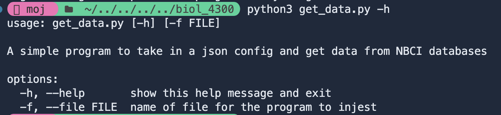

# Getting the Data

## Get Data from Genbank

### Running Script

To run the `get_data.py` script from the project root.

```bash
python3 scripts/get_data.py
```


### JSON Configuration

This script automatically looks for a `JSON` file in the same folder as the script named `config.json` at the root. If you want to pass in a differnt file it is the first argument given after the file name or you can specify using the `-f` or `--file` flag



This program creates a folder called data in the same folder as the script if it doesn't already exist, and two files for every gene listed in the json. One is the table information and one is the multi-fasta file.

The JSON has a list of any tax id you want to search for
As well as the following information on each gene you want to search for:

- **Name:** for logging on the console loading bar
- **Term:** used in the entrez term parameter
- **File Prefix:** used to name each file, for example if I have a file prefix of `mt` I will get two files named, `mt_seqs_fasta` and `mt_table.csv`
  Give the name
  For an example of the JSON format see `config.json`

### Environment Setup

#### Dependencies

All of the library dependencies are located in the requirements.txt to install them into your own environemnt run:

```python
pip install -r requirements.txt
```

#### NCBI API Key

This code requires a API key from NCBI and email address. These should be in a .env file and never input directly into the code.
For more informtion on getting an api key visit: [NCBI API Keys](https://support.nlm.nih.gov/kbArticle/?pn=KA-05317)

To setup your environment variables, edit the `api-key` and `email` in `.env.sample` and rename the file to remove `.sample`

```bash
ncbi_key=<api-key>
ncbi_email=<email>
```

## Creating Alignments

This Bash script automatically aligns all raw FASTA sequence files using **MAFFT**. It searches the `data/raw_data/` folder for any `*_seqs.fasta` files and saves the resulting alignments to `data/alignments/`.

### Usage

Run from the project root:

```bash
./scripts/align_all.sh
```

Each input file named like:

```
data/raw_data/<gene>_seqs.fasta
```

will produce an aligned output:

```
data/alignments/<gene>_alignment.fasta
```

### Requirements

- **[MAFFT](https://mafft.cbrc.jp/alignment/software/)** must be installed and available in your system path
  _(Test with `mafft --version`)_

## Trimming Alignments

This script (`trim.R`) automatically trims DNA alignments by removing gapped sites based on a given threshold, we ran this using 0.8. It processes all `*_alignment.fasta` files in the `data/alignments/` folder and saves the cleaned versions to `data/trimmed_alignments/`.

### Usage

Run from the project root:

```bash
Rscript scripts/trim.R
```

Optional arguments:

```bash
Rscript scripts/trim.R \
  --input_dir data/alignments \
  --output_dir data/trimmed_alignments \
  --trim_threshold 0.8
```

- **input_dir** — folder containing alignment FASTA files
- **output_dir** — destination for trimmed alignments
- **trim_threshold** — maximum allowed proportion of gaps per site (default: `0.8`)

Each trimmed file is saved as `<gene>_trimmed.fasta` in the output directory.

## Building the Supermatrix

This R script (`make_supermatrix.R`) combines all trimmed gene alignments into a single concatenated **supermatrix** for phylogenetic analysis. It uses the `SuperMatrix()` function from the **evobiR** package.

### Usage

Run from the project root `make_supermatrix.R`

The script will:

1. Read all `*_trimmed.fasta` files in `data/trimmed_alignments/`
2. Concatenate them into a single alignment (supermatrix)
3. Save the results in `data/supermatrix/`

## Maximum Likelihood Tree (Unpartitioned)

This command builds a maximum likelihood (ML) phylogenetic tree from the concatenated supermatrix alignment using [**IQ-TREE 3**](https://iqtree.github.io/). The analysis runs 1000 bootstrap replicates and automatically uses all available CPU cores.

### Usage

```bash

iqtree3 \
 -s data/supermatrix/super_matrix.fasta \
 -B 1000 \
 -T AUTO \
 --prefix data/ml_trees/iqtree_supermatrix

```
